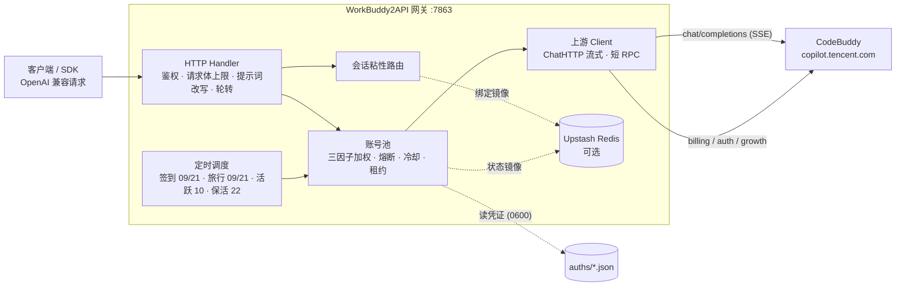

<p align="center">
  
</p>

<h1 align="center">WorkBuddy2API Admin</h1>

<p align="center">
  <b>支持 WorkBuddy 国际版网页登录的 OpenAI 兼容网关与管理面板</b><br>
  国际版 OAuth · 独立管理鉴权 · 账号管理 · 流式 API · Docker 部署
</p>

<p align="center">
  
  
  
  
  <a href="https://t.me/sliverkiss_blog"></a>
</p>

---

## 项目简介

本仓库基于 [Sliverkiss/workbuddy2api](https://github.com/Sliverkiss/workbuddy2api)，在保留上游国内版 / 国际版 API 和账号池能力的基础上增加独立 Web 管理面板。默认开发分支为 `admin-panel`。下方 Wiki 链接指向上游文档，管理面板以本页说明及本仓库源码为准。

## Web 管理面板

- **国际版登录**：面板使用 `www.workbuddy.ai` 的 OAuth 设备授权流程，支持授权轮询、取消、凭据安全保存及即时加入账号池；不会退回国内登录入口。
- **账号管理**：查看状态、刷新凭据、停用、恢复、二次确认删除。重复添加已有账号不会覆盖原凭据。
- **运行管理**：查看模型列表、基础运行状态及管理操作事件，修改并持久化业务 API Key。日志页不是完整的业务请求日志。
- **独立鉴权**：管理 Token 与业务 API Key 分离；普通 API Key 无管理权限。管理 Token 为空时，管理服务不启动。
- **访问隔离**：默认管理地址 `127.0.0.1:7864`；检查 Host、Origin 和管理请求头。推荐通过 SSH 隧道访问，不支持直接使用公网域名访问管理页。
- **范围说明**：面板目前只提供 `global` 国际版登录；国内版仍可使用上游 CLI 流程。

### Docker 部署管理版

需要 Docker Engine 和 Compose。下面使用独立可写数据目录，避免单文件只读挂载阻止面板原子保存配置。

```bash
git clone --branch admin-panel https://github.com/Justice-ocr/workbuddy2api-admin.git
cd workbuddy2api-admin
mkdir -p runtime/auths runtime/data
cp config.example.json runtime/config.json
umask 077
openssl rand -hex 32 > runtime/admin-token
```

编辑 `runtime/config.json`，保留其他配置，设置以下字段：

```json
{
  "listen": ":7863",
  "api_key": "REPLACE_WITH_A_SEPARATE_RANDOM_API_KEY",
  "auth_dir": "/app/runtime/auths",
  "state_file": "/app/runtime/data/state.json",
  "admin_listen": "0.0.0.0:7864",
  "admin_token": "",
  "admin_token_file": "/app/runtime/admin-token",
  "admin_allow_container_bind": true,
  "global": {
    "enabled": true,
    "chat_base": "",
    "billing_base": ""
  }
}
```

业务 API Key 必须另行生成，不能与管理 Token 相同。根据需要关闭示例配置中的自动任务。

创建 `compose.admin.yml`：

```yaml
services:
  workbuddy:
    build: .
    container_name: workbuddy2api
    restart: unless-stopped
    environment:
      TZ: Asia/Shanghai
    ports:
      - "127.0.0.1:7863:7863"
      - "127.0.0.1:7864:7864"
    volumes:
      - ./runtime:/app/runtime
    entrypoint: ["/app/wb2api", "-config", "/app/runtime/config.json"]
    security_opt:
      - no-new-privileges:true
    cap_drop:
      - ALL
```

```bash
sudo chown -R 10001:10001 runtime
sudo chmod 700 runtime runtime/auths runtime/data
sudo chmod 600 runtime/config.json runtime/admin-token
docker compose -f compose.admin.yml up -d --build
```

容器内管理服务绑定 `0.0.0.0` 是 Docker 端口映射所需的显式例外；**宿主机仍只发布到 `127.0.0.1`，不要改成公网监听**。不要同时启动仓库内另一份 Compose 来争用相同容器名和端口。

在自己的电脑建立隧道：

```bash
ssh -N -L 7864:127.0.0.1:7864 user@your-server
```

浏览器打开 `http://127.0.0.1:7864/`，输入服务器 `runtime/admin-token` 中的独立管理 Token，再点击添加国际版账号。令牌不要公开或提交进 Git。

### 公网 API 与升级

- 公网 HTTPS 反向代理只转发业务端口 `7863` 的 `/v1/models` 和 `/v1/chat/completions`；不要转发管理端口 `7864`。
- 国际版模型使用 `/v1/models` 返回的 `global:` 前缀，例如 `global:glm-5.2`，实际可用性由账号与上游决定。
- 升级前备份配置、账号及状态目录，停止旧实例再迁移；不要让两个实例同时刷新同一份账号凭据。
- 保留原 `api_key`、账号文件和模型前缀即可尽量减少客户端改动；新增独立管理 Token。
- 空账号池可能使 `/healthz` 返回不健康；需要完成账号授权后再验证真实对话。

### 开发验证

```bash
go test ./cmd/server ./internal/auth ./internal/pool ./internal/server
go build ./cmd/server
```

新增安全测试覆盖管理鉴权与访问限制。生产上线仍需验证实际 OAuth 授权、账号持久化、普通及流式 API；不能仅凭模型列表返回成功判断上游可用。

## 上游网关介绍

WorkBuddy2API 是一个自托管的 **OpenAI 兼容反向代理网关**，将 ```CodeBuddy``` 账号包装为统一的 `/v1/chat/completions` 服务。

- 官方不提供 OpenAI 形态的开放 API，本项目通过 **OAuth 设备授权**（`login.sh`）获取账号凭证，在网关侧做 token 自动刷新、账号池调度与流量治理；
- 面向 **个人多账号** 场景：多账号共享、单号故障自动换号、冷却 / 熔断防止雪崩、会话粘性保证多轮上下文不跳号；
- 对客户端只暴露 OpenAI 兼容接口，现有 SDK / 前端 / 工具 **零改造接入**。

> ⚠️ 合规须知：本项目是**非官方**网关，使用 ```CodeBuddy``` 账号作为上游，**仅限本人授权账号、本机 / 私有环境测试**。详细边界见[安全与合规](#安全与合规)。

📖 完整文档见 [GitHub Wiki](https://github.com/Sliverkiss/workbuddy2api/wiki)。

## 核心能力

### 账号池治理

- **OAuth 设备授权登录** — `login.sh` 一条命令完成：取授权 URL → 浏览器登录 → token 轮询 → 凭证落盘 → 重启加载，全程无 PKCE（state 由服务端签发），重复执行即可连续添加多账号
- **四因子加权随机选号** — `credits 比例 ×10 + 闲置补偿 + 成功率 ×3 + 快过期积分占比 ×8` 四项加权（`pool.expiring_soon` 窗口内的积分优先消耗，默认 7 天），按权重降序取 **Top-5 候选短名单**，再在短名单内加权抽签（等权重候选先随机打乱防惊群、LRU 兜底覆盖全部候选），兼顾积分多、闲置久、成功率高、快过期积分先用掉的账号
- **防惊群** — 跳过 100ms 内刚被选中的账号，多账号同时待命时不打爆同一台
- **在途租约** — 单账号最大在途请求数（`pool.max_in_flight`）限制并发占用，占满的号不参与选号，避免单号过载
- **账本择优** — 每次成功请求按 `usage.credit` 折算每千 token 单价记入 `(账号, 模型)` 账本，免费 / 便宜的账号优先；观测按 EMA 平滑、6 小时未更新即失效，成本随上游活动实时变化

### 流量治理

- **分级熔断与冷却** — 429 软冷却（600s 起指数退避、封顶 `soft_rate_max`）、404 固定浅冷却、402 / 余额耗尽硬冷却至次日 04:00、连续失败熔断（`breaker_threshold` 触发后指数退避封顶 6h）
- **模型级限流独立冷却** — 6004（该模型使用量超限）只冷却触发调用的模型，切其他模型立即可用；`/status` 透出 `rate_limited_models` 台账
- **状态持久化** — 池状态（积分 / 冷却 / 熔断 / 计数）本地原子落盘 `state.json`，可选镜像至 Upstash Redis，重启后择优恢复

### 请求链路

- **流式 + 非流式** — 出站强制 `stream:true`；SSE 帧按 OpenAI 规范白名单重建；非流式由本地聚合为单响应
- **DeepSeek 思维链注入** — 出站请求体注入 `thinking.type=enabled` + 默认档位，`reasoning_content` 多轮回填，`reasoning_effort` 按模型档位自动降级
- **系统提示词体系** — 默认透传客户端原始 system（`passthrough` 模式，缺省），仅自定义配置 `custom` 时网关用自有提示词替换客户端 system/developer（从源头消除模板句误报）；`passthrough` 模式遇拦截自动降级中性提示词重试
- **会话头族注入** — 出站携带官方客户端会话头族（`X-Conversation-Request-ID` 聚合主键 · `X-Conversation-ID` 透传 · B3 链路），轮转 / 重试 / 路径回退复用同键，后台按对话轮聚合不再碎片化（issue #35）
- **指纹脱敏** — 出站请求体黑名单指纹字段清洗（可开关），与提示词体系两层叠加

### 定时积分任务

- **签到**（09 / 21 点）— 每日签到 + 余额查询，余额恢复自动解冻冷却账号
- **活跃上报**（10 点）— 对话事件连发上报，点亮连登天数、解锁领养前置，回读 streak 自检
- **猫猫旅行**（09 / 21 点）— 独立排程：领养 / 派出 / 领奖闭环推进
- **token 保活**（22 点）— 全账号刷新 token，session 失效连续 3 次才禁用
- **开学季任务**（12 点）— 任务点亮 + claim + 自动抽空抽奖余额，活动下线时自动跳过
- **夜猫子任务**（01 点）— 夜猫窗口（23:00–08:00 CST）内补一次 black_cat 任务

六类任务独立排程、独立开关（`schedule.*_enabled`），互不影响。

### 双域适配

- 同时适配**国内版（CN，`copilot.tencent.com` / `www.codebuddy.cn`）与国际版（Global，`www.workbuddy.ai`）**账号
- 共享同一账号池，由账号 `realm` 或请求模型名前缀（`cn:` / `global:`）决定路由；`global.enabled` 可一键锁死纯 CN 部署
- 国际版支持注册激活、地区完善、一次性 trial 加油包领取（`./trial.sh`）

### 辅助工具

- 积分日报：`./credit.sh`（美化 / `-json`，realm 感知双域）
- 手动签到：`./signin.sh`（批量、幂等不重复计）
- 领养联动 / 任务查询：`scripts/task_runner.py`（成长任务一体机，默认 dry-run）
- 个性化提示词：`prompt.file` 指向自定义提示词文件即整体替换内置默认

## 架构总览



上游请求在出站前经历统一的改写管线（`internal/upstream/payload.go`）：强制 `stream:true`、`developer` 角色归一、tool_choice 归一、DeepSeek 思维链注入、`reasoning_effort` 档位降级、`reasoning_content` 回填、指纹脱敏。

## 快速开始

### 环境要求

- **Docker + Docker Compose**（推荐部署方式，镜像内已含 `app` 低权限用户与全部工具脚本）
- 一个或多个已注册的 CodeBuddy 账号，用于 OAuth 登录
- 宿主机 Go ≥ 1.22（仅源码构建时需要）

### Docker Compose 一键部署

```bash
git clone --branch admin-panel https://github.com/Justice-ocr/workbuddy2api-admin.git
cd workbuddy2api-admin
cp config.example.json config.json
```

编辑 `config.json`，**至少设置 `api_key`**（`留空 = 不鉴权`，公网部署务必设置）。示例中的 `test_key` 等均为占位符，`config.example.json` 不含任何真实密钥。

```bash
# 登录添加账号（重复执行可加多号）
./login.sh

# 启动服务
docker compose up -d --build

# 健康检查（无可用账号时 503）；service 字段用于确认打到的是本网关
curl -s http://localhost:7863/healthz
# {"healthy":2,"total":3,"service":"workbuddy2api"}
```

`login.sh` 内置授权 URL 获取 + 浏览器登录 + token 轮询 + 首次签到 + `auths/workbuddy-<uid>.json` 落盘 + 容器重启，全程无 PKCE（state 由服务端签发）。账号池在容器启动时用 `auths/` 目录自动对齐，新增凭证文件即自动发现。

### 源码构建

```bash
go build ./...
go vet ./...
go test ./...      # 完整测试套件
go run ./cmd/server -config config.json
```

构建二进制：

```bash
CGO_ENABLED=0 go build -trimpath -ldflags="-s -w" -o wb2api ./cmd/server
CGO_ENABLED=0 go build -trimpath -ldflags="-s -w" -o signin_bin ./cmd/signin
CGO_ENABLED=0 go build -trimpath -ldflags="-s -w" -o login ./cmd/login
CGO_ENABLED=0 go build -trimpath -ldflags="-s -w" -o credit ./cmd/credit
```

### 验证

```bash
# 模型列表
curl -s http://localhost:7863/v1/models -H "Authorization: Bearer your-api-key"

# 账号状态（汇总 + 每账号详情，disabled 账号透出 disabled_reason）
curl -s http://localhost:7863/status -H "Authorization: Bearer your-api-key"

# 流式聊天
curl -sN http://localhost:7863/v1/chat/completions \
  -H "Authorization: Bearer your-api-key" \
  -H "Content-Type: application/json" \
  -d '{"model":"deepseek-v4-flash","messages":[{"role":"user","content":"hi"}],"stream":true}'

# 非流式聊天（本地聚合）
curl -s http://localhost:7863/v1/chat/completions \
  -H "Authorization: Bearer your-api-key" \
  -H "Content-Type: application/json" \
  -d '{"model":"deepseek-v4-flash","messages":[{"role":"user","content":"hi"}],"stream":false}'
```

## 安全与合规

### 发布来源与合规边界

- **无预编译 release**：仓库无 Release / tag，产物 = 源码自构建（Dockerfile 多阶段在本地构建时完成）
- 登录 / 签到 / 积分工具：`./login.sh` / `./signin.sh` / `./credit.sh`
- **无产物校验和**：`go.sum` 仅约束 Go 模块依赖；Docker 镜像由本地 `docker compose build` 生成，未引用第三方镜像
- 上游 CodeBuddy 属第三方商业产品，本项目是其**非官方 OpenAI 兼容网关**；使用其账号做 API 网关涉及目标平台服务条款与账号风险，作者不对账号封禁、条款违约或使用结果负责

### 授权使用边界

- 仅限**本人授权账号**、本机 / 私有环境测试
- 不得共享、转售、违规分发，或用于违反目标平台条款的用途
- 遵守 CodeBuddy 平台服务条款与所在地法律
- 妥善保管 `auths/`（明文凭证）与网关端口

## 免责声明

本项目（包括但不限于代码、脚本、文档、配置示例及仓库内任何资源，下称「本项目内容」）**仅供个人学习与研究使用**。使用本项目表示您已阅读并接受本声明全部条款；如不同意，请立即停止使用并删除全部相关内容。

**1. 用途限制。** 本项目内容仅可用于个人学习、研究等非商业用途；请勿将本项目用于任何商业目的或牟利行为，请勿违反所属国家 / 地区 / 组织的任何法律法规。本项目不构成对任何软件、服务、平台的使用建议或授权。

**2. 账号与数据责任。** 本项目可能涉及个人账号凭证的获取、存储与使用。您应仅使用本人持有且已获授权的账号，自行确认相关平台的服务条款与允许范围，并自行承担使用、存储凭证（如 `auths/` 中的文件）及调用上游服务所产生的全部责任与风险。本项目不参与、不介入您与任何平台之间的契约关系。

**3. 内容与第三方界限。** 本项目内容中引用的第三方产品、服务、LOGO、图片、文案等，其权利均归各自权利人所有；本项目不保证此类内容的准确性、完整性、合法性，亦不代表支持或推荐任何第三方。如实存在侵权情形，请通过 Issues 告知，经核实后本项目会尽快处理。

**4. 无担保与风险自担。** 本项目内容按「现状」提供，不附带任何明示或默示的担保（包括但不限于适销性、特定用途适用性、准确性、不侵权等）。使用本项目（包括直接或间接）所产生的任何风险与后果（包括但不限于账号异常、数据丢失、服务中断、纠纷或损失），均由使用者自行承担，与本项目及其全部贡献者无关。

**5. 责任限定。** 在任何情况下，本项目及其作者、贡献者均不对任何直接、间接、偶然、特殊或后果性损害承担责任，无论该等损害是否基于合同、侵权或其他法律理论，即使已被告知发生该等损害的可能性。

**6. 修改与分发。** 基于本项目源代码进行的任何修改、衍生均系第三方自发行为，与本项目无关，相应后果由该第三方自行承担。本项目内所有资源文件，禁止任何公众号、自媒体进行任何形式的转载、发布。未经授权，任何组织或个人不得将本项目内容用于转载、发布或再分发。

**7. 条款变更。** 本项目保留随时修改、补充本声明的权利。修改后的声明自发布之日起生效，继续使用本项目即视为接受修订后的声明。本项目所有内容仅供学习和研究使用，请于学习研究完成后及时删除。

## ☕ Coffee

如果这个项目对你有帮助，欢迎请我喝杯咖啡～

<table>
  <tr>
    <td align="center"><b>💰 Solana</b></td>
    <td><code>AZAKF74rTu7UFVSNRzsKV4HHpTwarax6cG8KAh4fP5rQ</code></td>
  </tr>
  <tr>
    <td align="center"><b>💎 Ethereum</b></td>
    <td><code>0x1d418627aD6B043900CBE11fe439759bDF2b5170</code></td>
  </tr>
  <tr>
    <td align="center"><b>₿ Bitcoin</b></td>
    <td><code>bc1q9w7h4j9msyd9q6lhl0398n4s3g8h4vchpqvc2k</code></td>
  </tr>
</table>

## 管理面板新增功能

### 外观

管理台视觉参考 CuteLeaf/Firefly（https://github.com/CuteLeaf/Firefly ，在线示例 https://firefly.cuteleaf.cn/）：采用浅色层次、主题色导航和标题标记，保留适合管理工作的紧凑表格布局。样式为本项目独立实现，不包含 Firefly 的插画、字体、音乐或组件代码，不加载第三方资源。

右上角调色板入口支持亮色、暗色、跟随系统，以及薄荷绿、晴空蓝、蔷薇粉三种强调色。浏览器仅保存非敏感外观偏好，管理凭证不落入浏览器存储。

- 添加账号时可选择国际版或国内版，默认仍为国际版。OAuth 状态、授权域名和凭据保存按 realm 隔离；相同 UID 不覆盖已有凭据。
- 使用日志记录聊天请求的模型、账号 UID、流式模式、状态、耗时、输入/输出 Token 和上游返回的积分。支持 UTC+8 日期、UID、模型、结果筛选及分页；默认查看今天。
- 日志保存在 `state_file` 同目录的 `usage.json`，文件权限为 `0600`，最多保留 30 天、5000 条，约每 2 秒批量写入。异常断电可能丢失尚未写入的记录；写入失败会在管理页提示，不阻断公网 API。
- 日志不保存消息正文、请求头、API Key、账号令牌或上游原始错误。缺失的 Token/积分显示为未知而非零。它是请求级观测记录，不是计费账单：只记录最终一次请求结果，不累计内部重试消耗，也不包含鉴权失败、无法解析或过大的请求体等前置拒绝。
- 积分任务页只读查询所选账号的当前任务状态、进度与查询时间，不接受、执行或领取任务。复用仓库脚本的任务列表端点，按账号 realm 请求且不回退国内版，15 秒超时。
- **当日完成状态尚未确认**：现有任务返回字段不足以可靠归属完成日期，因此目前只展示当前快照，不将它标为“今日完成”。国际版任务端点的真实可用性仍需后续授权验证，失败时显示不可用。
- 以上功能继续使用独立管理鉴权及 loopback 管理端口，不增加公网管理路由，不改变已有 API Key。

## License

本项目采用 [MIT License](LICENSE) 开源协议。

- 在遵守 MIT License 前提下，允许使用、复制、修改、合并本项目源代码
- 再分发（源码或二进制形式）时，须保留原仓库的 MIT 版权声明与许可声明，并在 NOTICE 或 README 中注明原始出处 `https://github.com/Sliverkiss/workbuddy2api`
- 本项目不授予任何上游（CodeBuddy）接口或服务的权利；使用者仍需自行遵守上游服务条款
- 本项目的使用同时受上方**免责声明**约束；如免责声明与 MIT License 存在不一致，以免责声明为准
